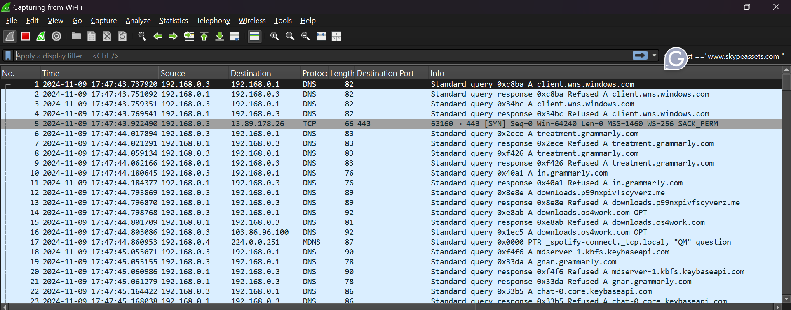
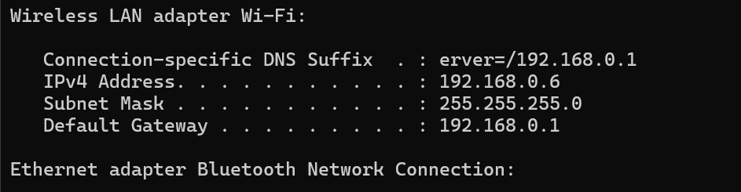
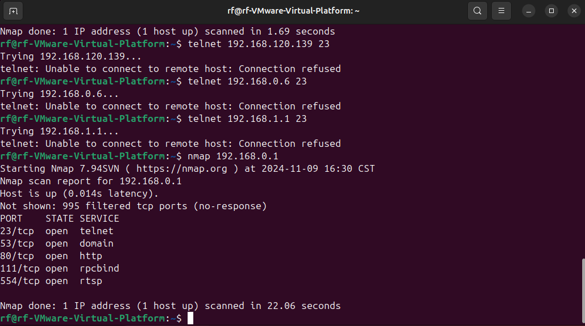
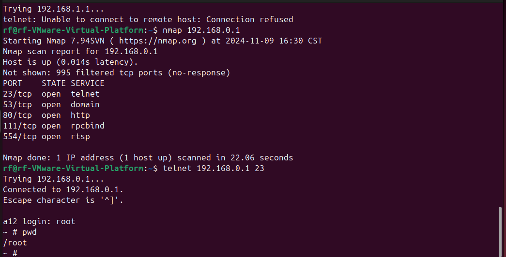
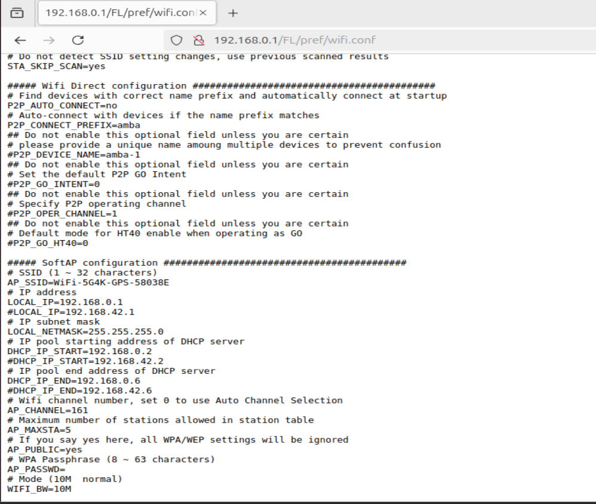
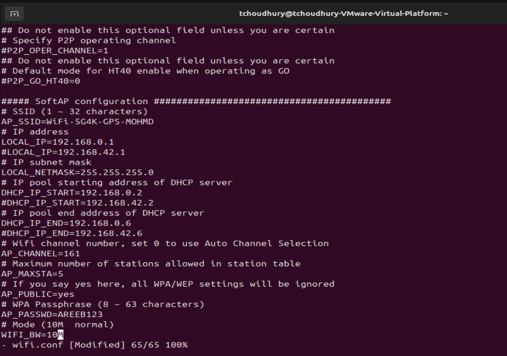
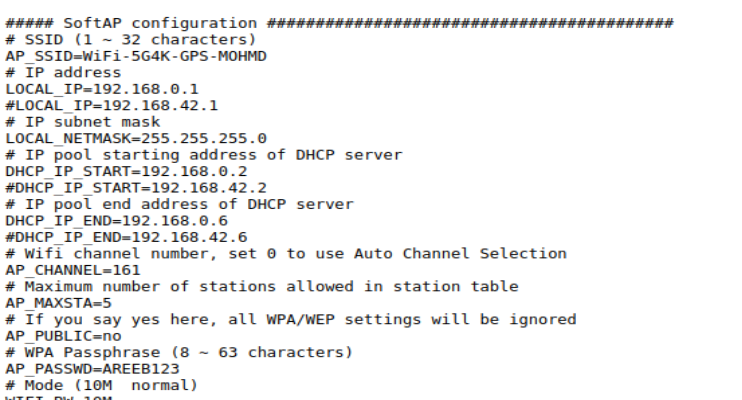
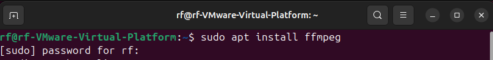
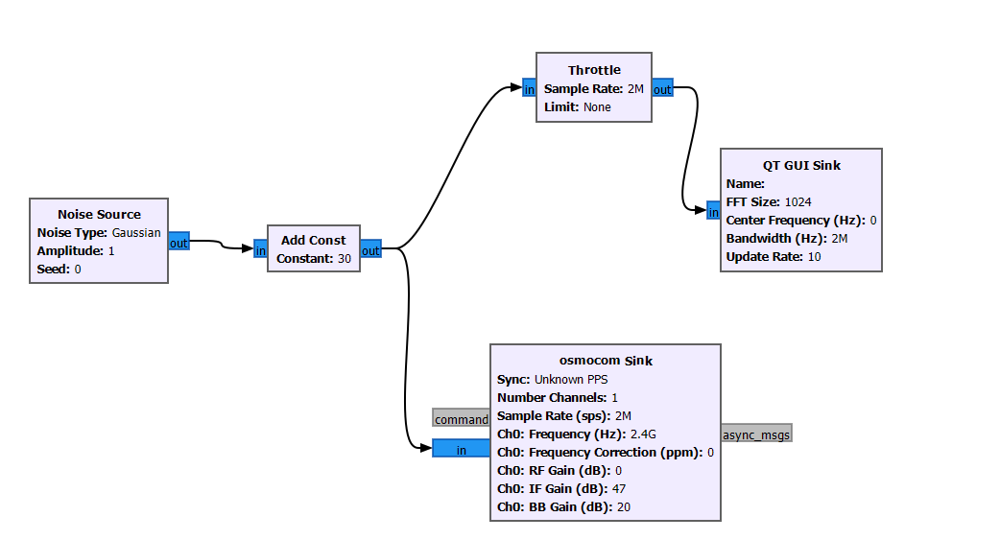

# Project - Drone Operations

## RFRE Fall 2024

### Mohamed kone 

### Objective

The goal of this project is to find ways to be able to run various attacks/exploits on a given drone to see if you can manipulate its functionality. The drone in question uses RF and WiFi signals for movement and video transmission. The ultimate goal behind this project is to use RF and find ways to manipulate WiFi.

---

## Methodology

Drone ZLL SG 906 max 2

With the general vectors of attack that were provided the ones I attempted to execute were:
--Remote file access
--Remote code execution
--Configuring Drone WiFi
--Jamming the controller
--Being able to read the drones WiFi Packet Communications
--Remote Camera Access

### Show drone WiFi communication packets 
I thought it was a good idea to first run a simple Wireshark and see what packet it is sending and receiving. For this initial step of the project, I first needed to activate the drone and the controller so the wifi connection would be visible. After connecting my devices was apart of the Drones wifi network. Fianlly I just ran a simple WIFI scan using wire shark.

These are the packet I found. 

### Discover open ports on the drone
I first went to my WIFI settings and looked for the WIFI information 

We can see all the information related to the WIFI Ip addresses and we will need that for the next steps. Specially the default gateway.
To discover open port I went on my Ubuntu vm and ran an nmap on the defaut gateway address to see if there were any open port.  `nmap 192.168.0.1`

### Demonstrate Remote File Access 
As can be seen by this nmap scan, there is sever  open ports that can be accessed. I decided to focus on `telnet`  which used port:`23`. I ran this command `telnet 192.168.0.1 23` to access the drones Linux shell. I was then asked to enter a login I typed root and just like that i had root privilege to the drone.

### Change the drone's WiFi password / Change the BCID of the drone's WiFi network
From this point on I began to experiment and look through all the files I had access to. I was specifically looking for the WiFi configurations. I then tried typing the IP of my drone into the browser and found a web domain. What I essentially found is a web interface containing stuff like where the log files, media, and configurations are supposed to stored.

After examining the name the domain, I then went to that directory in my system, and found where the drone stores the wifi configurations in a file called `wifi.conf`.

I then opened the file, edited the BCID and the password.

When loading up the IP on the localhost again the changes are kept and are displayed.

### Gain Unauthorized Remote Camera Access
Using the drone open ports I decided to use the `ffmpeg` package to play and view a live feed of the video. 
after downloading the package I then ran the command `ffplay -rtsp_transport tcp rtsp://192.168.0.1:554/live` to view the live feed of the drone.

### Jam the controller's signal 4 points 
Through looking up  frequencyinformation online and looking at gqrx I found its main area of operation of the drone was at 2.47GHz.

Then made a quick [GNU Radio Script](./Jammer/Jammer.grc) that would hypoethically be able to jam the controller signal by sending out noise at that frequency.

When trying to use it, I was not able to prevent commands from getting to the drone or affect the speed in which the commands reach it. I did find however it took longer for the drone to pair with the controller.

[video](./video/IMG_4147.mp4)

I also tried this with video feed of the drone which transmits at a rough frequency of 5.8 GHz. I then decided to modify my jammer scrip so it will work on that, but that also did not work that much.

### Conclusion
In this project, I explored vulnerabilities in a ZLL SG 906 max 2 drone, successfully accessing live video feeds, modifying WiFi configurations, and remotely accessing the drone’s Linux shell. While jamming attempts only  delayed controller pairing, it is my belief that it will work better if we had stronger anthenna
